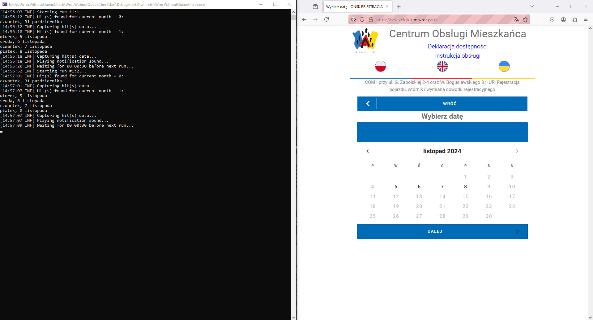

# 1. WrocWithoutQueueCheck
Simple console app that notifies about openings on `bez-kolejki.um.wroc.pl`. Written mostly for own usage + a bit of self-learning (AKA: not very-well written eg. miles-long main program loop ;)). Still, I figured that it might help somebody, that (like me) has better things to do with their life than manually re-navigating to the same page over and over again.

- [1. WrocWithoutQueueCheck](#1-wrocwithoutqueuecheck)
  - [1.1. Main features / what can it do](#11-main-features--what-can-it-do)
  - [1.2. What can't it do](#12-what-cant-it-do)
  - [1.3. Quickstart](#13-quickstart)
    - [1.3.1. From executable (Windows/Linux)](#131-from-executable-windowslinux)
    - [1.3.2. From Docker](#132-from-docker)
    - [1.3.3. Settings](#133-settings)
      - [1.3.3.1. appsettings.json](#1331-appsettingsjson)
      - [1.3.3.2. smtp.json](#1332-smtpjson)

## 1.1. Main features / what can it do

1. Repeatedly navigates to to the site, and returns the days tha should contain hits/openings (by using FF web browser).
2. Can restart its browser session in case of problems (AKA: should be resilient to crashes).
3. Plays sound whenever it finds hit/opening.
4. Should work on both Windows and Linux (Docker included).
5. Documents the hits (with screenshots and html dumps), also logs everything it does (including crashes).
6. Can use SMTP to send notifications about the hits (as well as crashes and summary reports).

## 1.2. What can't it do

1. Automatically book the opening; this is intentional, as it would have been too invasive for potentially malicious usage + I'd have to work around CAPTCHA.
2. Notify, which specific hours are free; potential improvement, I couldn't see any openings for my case during initial development, so I didn't even get to see this 2nd step view ;)
3. Narrow down the results to specific dates; also potential improvement, though I was never really interested in it; openings were so scarce for me, that I wouldn't get many notifications anyway.

## 1.3. Quickstart

### 1.3.1. From executable (Windows/Linux)

1. Download the released package and unpack it (or build it yourself from the source).
2. Edit `appsettings.json`; you will probably want to customize `PlaceName` and `DocumentType` at least; rest of the parameters explained in detail [elsewhere](#133-settings).
3. Run the executable (`WrocWithoutQueueCheck.exe` for Windows, `WrocWithoutQueueCheck` for Linux), preferably from powershell/terminal.
4. [Linux only] if it crashes due to missing packages you may need to install `libasound2` and `libgtk-3-dev`, similar to the way it is done in [Dockerfile](WrocWithoutQueueCheck/Docker/Dockerfile).

### 1.3.2. From Docker

Note: I didn't bother pushing it to any actual docker registry (nor do I plan to), so it has to be built from source.

0. Have Docker installed an working.
1. Clone repository, pull the latest (or download it directly).
2. Make sure that `BrowserHeadlessMode` is set to `true` in `appsettings.json`; otherwise, it is likely to not work at all (one can't run desktop browser in console-only environment).
3. Open powershell/terminal, go to [Docker directory](WrocWithoutQueueCheck/Docker).
4. Run `docker-compose up` (or `docker-compose up -d` to run in the background).

### 1.3.3. Settings

#### 1.3.3.1. appsettings.json

Note: all the configurable settings have to be set here, there is no GUI, no command line arguments etc.

Parameter                                            | Explanation
---------------------------------------------------- | -------------
Url                                                  | Main page url; do not change it, unless it was actually moved (or you have to use proxy or direct IP for whatever reason)
DefaultTimeoutSeconds                                | Max time it will wait for element (eg. button, label etc.) when navigating through the website; unless your connection is **very** slow, do not alter it; note that this is maximum time, so lowering it will **not** make anything work faster
BrowserHeadlessMode                                  | Determines, whether browser gets physically run, and you can see it in the foreground; it makes sense to disable it for the first run and/or debugging, but generally should be enabled after that (less resources used, no annoying window flashing in the background, won't break because you clicked on something etc.)
MaxNumberOfRunsPerBrowserSession                     | Number of times it runs per browser session; default here is rather arbitrary number, I figured that it should be resatarted once in a while, in case it got stuck and/or to reset browser data, also re-approve the terms; it may likely be increased (for better performance) or decreased (for more stabilty), but I haven't tried that
DelayBetweenRunsSeconds                              | This is a static timeout between the runs; please do not set it too low, in order to not spam this poor website too much (and also possibly to not get blocked after excessively large number of requests?)
PlaceName                                            | This is a place every run will select, which is a text directly from the UI; see [PlaceNameExample](Resources/PlaceNameExample.png)
DocumentType                                         | This is a document every run will select, which is a text directly from the UI; see [DocumentTypeExample](Resources/DocumentTypeExample.png)
MaxNumberOfFutureMonthsToCheck                       | Max number of months forward to check; please note, that eg. for some cases only ~2 weeks forward seem to be available, so it may not matter what you set here (as long as number is greater than 1)
NotificationSoundOnError                             | Determines, whether to play sound on error; note, that this is regardless of what caused the error (may be problem with the website, may be problem with the program itself, may also be internet outage); you may want to leave it disabled outside of specific cases (eg. debugging)
NotificationSoundOnHit                               | Determines, whether to play notification sound when opening was found
NotificationEmails                                   | Determines, whether notification emails are to be sent at all; note, that for this to work, you have to have `smtp.json` present and set up properly; see [here](#1331-smtpjson)
TimeBetweenNotificationEmailWithTheSameHitsMinutes   | [matters only if `NotificationEmails` = `true`] Determines how much time should pass to send overlapping notification. Should be set to something relatively long (maybe even longer than the default) because on one hand you may want re-notification in case you missed the first one, but on the other hand you don't want to keep spamming the same set of info that you already have
TimeBetweenSummaryEmailHours                         | [matters only if `NotificationEmails` = `true`] Determines how often summary email (overall numbers of hits, errors + logs) should be sent

#### 1.3.3.2. smtp.json

Note: this is optional file, it matters only if you are interested in sending notification emails. Also, for it to work you have to set `NotificationEmails` = `true` first.

First of all, this one has to be renamed from `smtp.json.sample` to `smtp.json`; this is because `smtp.json` is excluded from the repo in `.gitignore` (to avoid accidentally pushing/publishing it, as by definition it contains private emails and password). Needless to say, do not share this file after you filled it in.

Name of the parameters themselves are self-explanatory here and they should be taken directly from the SMTP server that you are planning to use to send emails; the only exception is `SmtpNotificationReceiver` which should just be an email address, which will receive emails in the end (AKA: most likely your email).

If you don't know what any of this means or you do not have access to SMTP and/or not planning to host your own, there is a free alternative. Apparently, any regular/free GMail account can be used as SMTP, although you have to enable specific security options to make that happen. For more information, search online. Be careful though, as Google imposes certain limitations and may lock/ban you if you ever exceed the allowed quota and/or it finds anything that it deems suspicious; thus I'd advise against using main account for that, and create fake one instead.